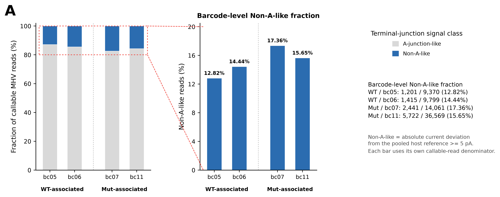

# mhv_polya

Reproduce the barcode-level terminal-junction Non-A-like fraction in Figure 6A. The analysis compares terminal current with stable-poly(A) current from the same read, centres that difference on a pooled host reference, and applies a two-sided 5 pA cutoff.



## Run the figure workflow

Install the Linux CPU environment:

```bash
conda env create -f environment.yml
conda activate mhv-terminal-nona
```

From this repository, run:

```bash
bash scripts/run_figure.sh /path/to/MHV_polyA /path/to/barcode_figure_run
```

The first argument is the input directory; the second is a new output directory. [run_figure.sh](scripts/run_figure.sh) contains the commands in execution order: five analysis steps, followed by validation. Progress appears in the terminal and each step writes a log under the output directory's `logs/` folder.

Allow 4 GB RAM and 2 GB output space. The study inputs occupy 6.22 GB; the recorded server run took about 2.6 minutes.

## Input

The starting point is demultiplexed POD5 raw current plus the archived WDX, Dorado and alignment outputs used in the study.

| Input | Files | Purpose |
|---|---:|---|
| Barcode POD5 | 5 | Calibrated raw current |
| Host and viral alignment BAM | 10 | Host/MHV membership and mapping barcode |
| Dorado poly(A) BAM | 5 | Read quality for host-reference selection |
| WDX boundary CSV | 7 | Raw-signal boundary coordinates |
| WDX barcode prediction CSV.gz | 7 | Barcode assignment |
| Read-length and WDX estimate TSV | 2 | Read metadata |
| **Total** | **36** | |

Barcodes are **bc04 = mock, bc05/bc06 = WT, bc07/bc11 = Mut**. Host reads from all five define the reference; the figure displays MHV reads from the four infected barcodes.

[inputs.tsv](config/inputs.tsv) lists the exact input paths, relative to the input directory, and their study file sizes. [Input/output definitions](docs/INPUT_OUTPUT.md) specify required fields, units and missing values. See [data availability](#citation-and-data-availability) for the accession status.

## Core scripts, in order

| Step | Script | Result |
|---|---|---|
| 1 | [build_warpdemux_host_virus_polya_table.py](scripts/upstream/build_warpdemux_host_virus_polya_table.py) | Join read IDs, mapping assignments and WDX metadata |
| 2 | [extract_terminal_u_features.py](scripts/upstream/extract_terminal_u_features.py) | Signal metadata and clipped poly(A) spans |
| 3 | [extract_dorado_polya_anchors.py](scripts/upstream/extract_dorado_polya_anchors.py) | Dorado quality scores and read metadata |
| 4 | [score_terminal_current.py](scripts/analysis/score_terminal_current.py) | Per-read current differences, reference and Non-A-like calls |
| 5 | [build_figure6A_overall_mut_vs_wt.py](scripts/analysis/build_figure6A_overall_mut_vs_wt.py) | Barcode figure and source tables |
| 6 | [validate_figure.py](scripts/validate_figure.py) | Compare counts, reference and tables with the study results |

Step 4 calls `score_all_reads` in [call_terminal_nona_direct_cutoff.py](scripts/analysis/call_terminal_nona_direct_cutoff.py), which implements the signal calculation shared with the advanced workflow.

### Execute each step separately

These commands are the individual steps of `run_figure.sh`. Use them with a new output directory when running the analysis interactively.

```bash
# Setup: use absolute paths for the data and output directories.
repo_root="$PWD"
project_root=/path/to/MHV_polyA
output=/path/to/barcode_figure_run

base="${project_root}/MHV_Multiple_sample"
warp="${base}/Warpdemux_polyA/warpdemux_WDX6_rna004_v1_0_20260318_1039_ade68d6a"
pod5="${base}/20260306_5bar/20260306_1823_MN25294_FAZ51928_089bb3a7/pod5_by_barcode"
view="${output}/work/project_view"
mkdir -p "$(dirname "$output")"
mkdir "$output"
mkdir -p "$view" "${output}/inputs" "${output}/results"
ln -s "$base" "${view}/MHV_Multiple_sample"
export PYTHONDONTWRITEBYTECODE=1 PYTHONHASHSEED=0 MPLBACKEND=Agg
export MPLCONFIGDIR="${output}/work/matplotlib"
cd "${output}/work"

# 1. Join mapping assignments and WDX metadata.
python "${repo_root}/scripts/upstream/build_warpdemux_host_virus_polya_table.py" \
  --base "$base" --warp-run "$warp" \
  --outdir "${view}/polyA_host_virus_by_barcode_warpdemux"

# 2. Extract signal metadata.
python "${repo_root}/scripts/upstream/extract_terminal_u_features.py" \
  --project-root "$view" --outdir "${output}/inputs/base_features"

# 3. Extract Dorado quality and metadata.
python "${repo_root}/scripts/upstream/extract_dorado_polya_anchors.py" \
  --bam-dir "${base}/polyA_bam/polya_5pod5_results" \
  --boundary-dir "${warp}/boundaries" --outdir "${output}/inputs/anchors"

# 4. Calculate within-read differences and Non-A-like calls.
python "${repo_root}/scripts/analysis/score_terminal_current.py" \
  --features "${output}/inputs/base_features" --anchors "${output}/inputs/anchors" \
  --pod5-dir "$pod5" --output "$output"

# 5. Draw the barcode figure.
python "${repo_root}/scripts/analysis/build_figure6A_overall_mut_vs_wt.py" \
  --source-parquet "${output}/work/scores/mhv_read_scores.parquet" \
  --output-root "${output}/figure6A" --figure-mode barcode

# 6. Validate the result.
python "${repo_root}/scripts/validate_figure.py" --run "$output"
```

## Output

```text
barcode_figure_run/
├── figure6A/
│   ├── output/figure6A_barcode_level_mut_vs_wt_virus.{pdf,png,svg}
│   └── data/
│       ├── figure6A_overall_virus_barcode_summary.tsv
│       └── figure6A_overall_virus_read_level.tsv.gz
├── results/
│   ├── host_read_scores.tsv.gz       # 82,709 reads × 30 columns
│   ├── mhv_read_scores.tsv.gz        # 86,406 reads × 30 columns
│   └── analysis_parameters.json
├── figure_validation.json
├── logs/
├── inputs/                          # generated metadata and feature arrays
└── work/                            # intermediate tables and plotting cache
```

The figure source table has **84,900 reads × 19 columns**. The barcode summary supplies the bars and count labels. PDF and SVG are vector outputs; PNG is rendered at 400 dpi. Intermediate Parquet and NPY files are generated during execution.

| Barcode | Group | All MHV reads | Callable | Non-A-like | Fraction among callable reads |
|---|---|---:|---:|---:|---:|
| bc05 | WT | 11,405 | 9,370 | 1,201 | 12.82% |
| bc06 | WT | 12,182 | 9,799 | 1,415 | 14.44% |
| bc07 | Mut | 17,284 | 14,061 | 2,441 | 17.36% |
| bc11 | Mut | 44,029 | 36,569 | 5,722 | 15.65% |

## Method

For each read, `W` is the WDX primary CNN `polya_start`. Coordinates are zero-based raw-signal samples; intervals are half-open and calibrated current is in pA.

```text
terminal_i = mean(signal_pa[W-16 : W+15])
stableA_i  = mean(signal_pa[W+46 : W+77])
x_i        = terminal_i - stableA_i
x_A        = median(x_i for eligible long-host reference reads)
Non-A-like = (abs(x_i - x_A) >= 5.0 pA)
```

The host reference requires callable signal, a signal-clipped WDX poly(A) span of at least 100 nominal nt, and Dorado mean quality ≥12. It contains **26,997 reads**, with **x_A = −10.190704345703125 pA**. Callability requires matching WDX/mapping barcodes, a CNN boundary, complete finite windows and a detected poly(A) span of at least 77 samples. Each bar uses its own callable-read denominator.

[Methods](docs/METHODS.md) and the [figure caption](docs/FIGURE6A_METHODS.md) give the full scientific definitions. Non-A-like is a current-deviation phenotype; the figure reports descriptive barcode fractions.

## Settings and result checks

The repository contains three JSON files, each read by a script:

| File | Purpose |
|---|---|
| [analysis_config.json](config/analysis_config.json) | Fixed signal parameters and expected host reference |
| [figure_io_schema.json](schemas/figure_io_schema.json) | Expected columns and read counts for figure validation |
| [observed_io_schema.json](schemas/observed_io_schema.json) | Table definitions for advanced analysis validation |

Input paths are listed in TSV files. Execution produces its own parameter and validation reports in the output directory. [Validation notes](docs/VALIDATION.md) describe the recorded study reconstruction and how to repeat the checks.

## Advanced analysis

sgRNA/gRNA assignment, transcript summaries, tail-length analyses, sensitivity analysis and other figures are available separately:

```bash
bash /path/to/mhv_polya/scripts/run_pipeline.sh \
  --project-root /path/to/MHV_polyA \
  --output /path/to/advanced_analysis_run --advanced --execute
```

[Advanced analysis](docs/ADVANCED_ANALYSIS.md) defines the additional scripts and outputs. It uses the 36 primary inputs plus five viral BAM indices.

## Citation and data availability

**Code DOI:** pending.

**Input data accession:** pending. The 36 files needed to reproduce the figure are listed in [inputs.tsv](config/inputs.tsv).

[Environment and preprocessing details](docs/REPRODUCIBILITY.md) describe the study's starting data and software versions.
